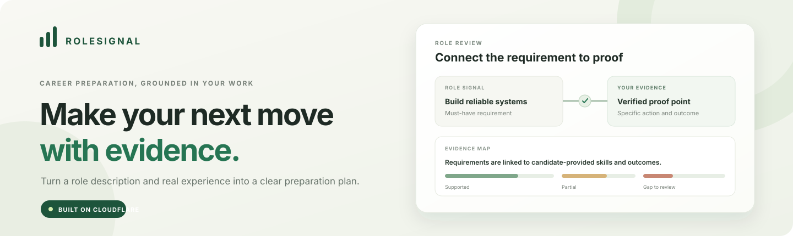
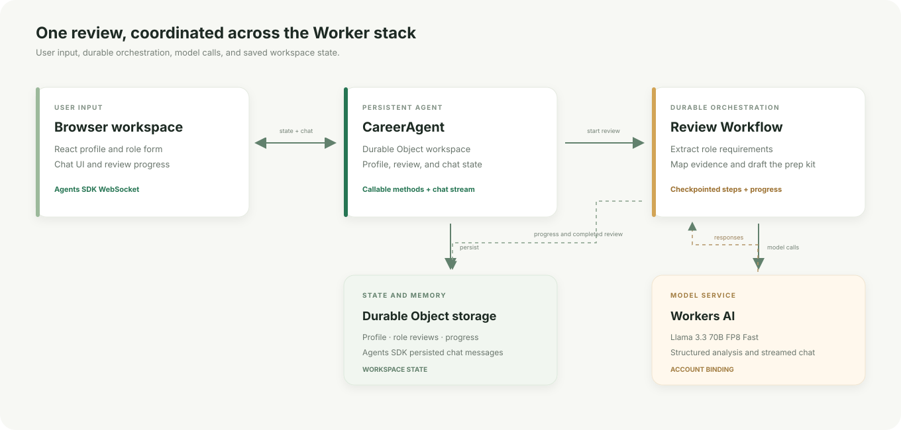

# RoleSignal

<p align="center">
  
</p>

<p align="center"><strong>An evidence-led career preparation workspace, built on Cloudflare.</strong></p>

<p align="center">
   Workers AI
  &nbsp;&nbsp;·&nbsp;&nbsp;
   Workflows
  &nbsp;&nbsp;·&nbsp;&nbsp;
   Agents SDK
  &nbsp;&nbsp;·&nbsp;&nbsp;
   Durable Objects
</p>

RoleSignal turns a job description and a candidate's stated experience into a reviewable preparation plan. It connects role requirements to skills and outcome-based proof points, makes unsupported areas visible, and drafts interview practice and application materials. A persistent chat helps the candidate refine their story using the same profile and role context.

> **Demo data:** The included candidate, achievements, metrics, employer, and role are fictional. Replace them with your own verified information before using the app for a real application. Do not enter sensitive personal data into this demo.

<h2> Product overview</h2>

- **Maps a role to evidence.** The app extracts role requirements and connects them to candidate skills and proof points. Unsupported requirements remain visible as gaps.
- **Shows its reasoning.** Each match includes its importance, evidence source, and rationale. A fixed rubric calculates the fit score in application code.
- **Builds a preparation kit.** Candidates receive practical next actions, interview questions with practice angles, and a first-pass cover letter.
- **Keeps a persistent workspace.** A candidate can return to the same browser workspace and continue a saved role review or chat.
- **Leaves decisions with the candidate.** RoleSignal does not submit applications, send messages, or contact employers. Review every model-generated statement before using it.

<h2> How the project meets the assignment</h2>

| Assignment component      | Implementation                                                                                                                             |
| ------------------------- | ------------------------------------------------------------------------------------------------------------------------------------------ |
| LLM                       | Meta Llama 3.3 70B FP8 Fast through the Cloudflare Workers AI binding, for structured role analysis and streamed chat.                     |
| Workflow and coordination | Cloudflare Workflows checkpoints the multi-stage role review and reports progress to the workspace.                                        |
| User input                | A React role form, editable profile, and chat UI are served by the Worker. The Agents SDK connects the chat and workspace over WebSockets. |
| Memory and state          | A named Durable Object stores the profile, role reviews, and progress. The Agents chat runtime persists the conversation.                  |

<h2> Architecture</h2>

<p align="center">
  
</p>

### Review lifecycle

1. **Connect to a workspace.** The browser creates a random workspace identifier and connects to the named <code>CareerAgent</code>. The Agents SDK syncs workspace state over a WebSocket.
2. **Save candidate evidence.** A candidate can edit a headline, skills, and proof points. Server-side Zod schemas validate profile and role input before it is stored.
3. **Start a durable review.** The agent saves a queued role record, then starts the <code>APPLICATION_REVIEW</code> Workflow.
4. **Analyze in checkpointed steps.** The Workflow extracts role requirements, maps them to submitted evidence, drafts a preparation kit, and writes a positioning summary. Each stage is a durable <code>step.do</code> operation and updates visible progress.
5. **Resolve evidence and calculate the score.** The app resolves proposed proof-point IDs against the submitted profile. IDs that are not present cannot become linked evidence. Application code calculates the score and recommendation.
6. **Save and continue.** The completed analysis is saved to agent state. The browser can reconnect to its role history and chat using the same workspace identifier.
7. **Chat with context.** Chat requests include the profile and selected role summary. The model streams a response through the Workers AI binding; the Agents chat runtime persists messages.

### Fit rubric

The model proposes requirement importance and evidence matches. The application calculates the fit score with fixed weights:

| Requirement importance | Weight |
| ---------------------- | -----: |
| Must-have              |      3 |
| Important              |      2 |
| Nice-to-have           |      1 |

| Match strength                                               | Value |
| ------------------------------------------------------------ | ----: |
| Strong, with a linked proof point                            |   1.0 |
| Partial, including a listed skill without an outcome example |   0.5 |
| Gap or no profile support                                    |     0 |

**Formula:** <code>round(100 × sum(requirement weight × match value) / sum(requirement weights))</code>.

Recommendation labels are <code>strong fit</code> at 72 or above, <code>bridge gaps</code> from 45 through 71, and <code>stretch</code> below 45. These cutoffs are product heuristics, not validated hiring criteria. A listed skill without a matching proof point cannot receive the strongest evidence label. Candidates should verify that each semantic match and rationale is fair.

### Why these Cloudflare components

- **Agents SDK and Durable Objects:** a named agent provides a persistent workspace and chat connection rather than a stateless form submission.
- **Workflows:** a role review spans multiple model calls. Durable steps expose progress and let the runtime resume work without treating analysis as one long request.
- **Workers AI:** structured review and streamed chat use the same account-bound model service.
- **Worker-hosted assets:** the Worker serves the React application and agent routes as one deployable project.

<h2> Repository map</h2>

| Path                                | Purpose                                                                                                        |
| ----------------------------------- | -------------------------------------------------------------------------------------------------------------- |
| <code>src/app.tsx</code>            | Role form, editable candidate profile, evidence map, score, preparation kit, and chat UI.                      |
| <code>src/server.ts</code>          | <code>CareerAgent</code>, callable profile and review methods, Workers AI chat stream, and Workflow callbacks. |
| <code>src/workflow.ts</code>        | Role extraction, evidence mapping, preparation-kit generation, positioning, scoring, and durable save.         |
| <code>src/contracts.ts</code>       | Shared Zod schemas and explicitly fictional demo profile and job description.                                  |
| <code>src/styles.css</code>         | Responsive visual design for the career workspace.                                                             |
| <code>wrangler.jsonc</code>         | Workers AI, Durable Object, Workflow, SPA assets, migration, and observability configuration.                  |
| <code>env.d.ts</code>               | Wrangler-generated Cloudflare binding and runtime types.                                                       |
| <code>public/favicon.svg</code>     | RoleSignal application mark.                                                                                   |
| <code>docs/assets/</code>           | Repository cover, architecture illustration, and accessible section icon images.                               |
| <code>PROMPT_HISTORY.md</code>      | Assignment prompt and the project-direction prompts used to define the implementation.                         |
| <code>PROJECT_WALKTHROUGH.md</code> | Demo path, architecture explanation, and interview discussion notes.                                           |

<h2> Local setup</h2>

### Prerequisites

- Node.js **22.12 or newer**.
- npm.
- A Cloudflare account with Workers AI access to the configured model.
- Network access. The Workers AI binding is configured with <code>remote: true</code>, so model calls from local development use the remote Cloudflare binding.

### Install and run

```bash
npm ci
npx wrangler login
npm run dev
```

Open the local URL printed by Vite. The app starts with fictional sample data. Load the sample role or paste a job description, then choose **Map my fit**. The first review makes several model calls; follow the progress panel as the Workflow runs.

Wrangler login is needed for the remote Workers AI binding. If you have multiple Cloudflare accounts, check that the CLI is authenticated to the account you intend to use.

### Generate Cloudflare binding types

After changing bindings, Workflow classes, or Durable Object configuration in <code>wrangler.jsonc</code>, run:

```bash
npm run types
```

This regenerates the types used for the <code>AI</code>, <code>CareerAgent</code>, and <code>APPLICATION_REVIEW</code> bindings.

### Available code checks

```bash
npm run check
```

The command checks formatting, runs Oxlint on <code>src/</code>, and runs TypeScript. The package also exposes <code>npm run lint</code> for linting alone.

<h2> Deploy to Cloudflare</h2>

```bash
npx wrangler login
npm run types
npm run deploy
```

<code>npm run deploy</code> builds the Vite application and deploys the Worker and configured resources to the account selected by Wrangler. Review the Worker configuration, model access, account limits, and deployed behavior in your Cloudflare account before sharing a live URL.

**Deployment status:** This repository contains deployment configuration and instructions. The app has not been deployed to a Cloudflare account.

<h2> Demo walkthrough</h2>

1. Show the profile and explain that all sample achievements, metrics, and role information are fictional.
2. Edit a skill or proof point and save the profile.
3. Load the Northstar Labs sample role and start a review.
4. As the review runs, explain the Workflow stages and how progress is written to workspace state.
5. Compare a proof-backed match, a skill-only partial match, and an explicit gap.
6. Explain that the fit score is a weighted evidence rubric, not a hiring prediction.
7. Ask chat to help structure an interview answer from a proof point. Confirm that the candidate supplies any missing facts.

See [PROJECT_WALKTHROUGH.md](./PROJECT_WALKTHROUGH.md) for a ready-to-use presentation and interview talk track.

<h2> Data handling and current limits</h2>

- **Authentication is not configured.** The random browser workspace identifier is a routing key, not an identity check or authorization boundary.
- **Use fictional or non-sensitive information in this demo.** Profile and role-review state are stored in the workspace Durable Object. The job description and profile are sent to Workers AI for role analysis; chat requests include profile and selected-role context.
- **Model output needs human review.** Zod validates structure, proof-point IDs are resolved against submitted data, and the score is calculated in code. These safeguards do not establish that a semantic match or explanation is correct.
- **No external actions are available.** The app has no feature for submitting applications, sending email, or contacting employers.
- **Workspace retention is basic.** The browser stores the workspace identifier in <code>localStorage</code>; clearing site data loses the identifier. The agent retains up to 100 chat messages and the workspace keeps up to 12 role reviews.
- **Production use needs additional controls.** Add authentication and per-user authorization, deletion and export controls, explicit retention settings, and abuse and rate controls before processing real candidate data. Review model and observability settings for the intended privacy requirements.
- **Observability is enabled.** Workflow failure logs include the review ID and omit raw error details and profile content.

<h2> Troubleshooting</h2>

| Symptom                                          | Check                                                                                                                                                     |
| ------------------------------------------------ | --------------------------------------------------------------------------------------------------------------------------------------------------------- |
| Role review or chat cannot call the model        | Run <code>npx wrangler login</code>; confirm the selected Cloudflare account and Workers AI model access; check the remote <code>AI</code> binding.       |
| Binding or Workflow TypeScript names are missing | Run <code>npm run types</code> after changing <code>wrangler.jsonc</code>.                                                                                |
| A review starts but does not finish              | Inspect local Worker and Workflow logs. Each structured model response must satisfy its schema.                                                           |
| A previous workspace appears to be missing       | Check this browser's site storage. Its random workspace identifier is stored in <code>localStorage</code>; clearing it points the app at a new workspace. |

<h2> AI-assisted coding prompt history</h2>

The assignment asks candidates to submit prompt history. [PROMPT_HISTORY.md](./PROMPT_HISTORY.md) includes the assignment and the project-direction prompts that shaped this implementation. [PROJECT_WALKTHROUGH.md](./PROJECT_WALKTHROUGH.md) documents the architecture and demo presentation.

<h2> References</h2>

- [Cloudflare Agents SDK](https://developers.cloudflare.com/agents/)
- [Agents SDK configuration](https://developers.cloudflare.com/agents/runtime/operations/configuration/)
- [Chat agents](https://developers.cloudflare.com/agents/communication-channels/chat/chat-agents/)
- [Agents and Workflows](https://developers.cloudflare.com/agents/runtime/execution/run-workflows/)
- [Llama 3.3 70B FP8 Fast on Workers AI](https://developers.cloudflare.com/workers-ai/models/llama-3.3-70b-instruct-fp8-fast/)
- [Official Cloudflare Agents starter](https://github.com/cloudflare/agents-starter)
