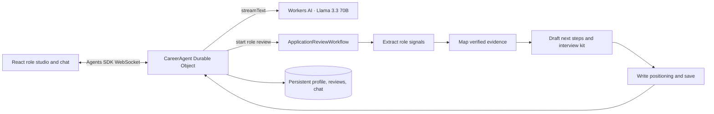

# RoleSignal

**Make your next move with evidence.**

RoleSignal is a Cloudflare AI application for career preparation. Give it a job description and a profile of confirmed skills and outcomes. It returns a requirement-by-requirement evidence map, an explainable fit rubric, practical next steps, interview prompts, and a first-pass cover letter. A persistent chat agent can help the candidate refine the story.

The included candidate and Northstar Labs role are fictional demo data. Replace them before using the app for a real application.

## Why this project

RoleSignal makes the assignment's AI components work together around one useful task:

- **LLM:** Meta Llama 3.3 70B FP8 Fast on Cloudflare Workers AI extracts role requirements, maps evidence, and drafts career-preparation material.
- **Coordination:** Cloudflare Workflows checkpoints the multi-step role review and reports progress to the app.
- **User input:** A React chat and role form run on Cloudflare Workers static assets; the Agents SDK streams chat over a WebSocket.
- **Memory:** A named Durable Object stores profile and review state, while the Agents SDK persists chat history for that workspace.

The app never submits an application or contacts an employer. A person reviews every result.

## Product flow

1. Edit the candidate profile and its proof points, or start with the clearly labelled fictional sample.
2. Paste a job description and start a role review.
3. Follow the durable workflow as it extracts role signals, maps them to exact skills and proof-point IDs, drafts an application kit, and saves the result.
4. Inspect the fit rubric, rationale, source proof point, skill-only matches, and gaps.
5. Ask the persistent chat agent to rehearse or clarify something. It receives the current profile and selected role context.

The score is a transparent matching rubric, not an estimate of hiring odds. Must-have requirements weigh 3, important requirements 2, and nice-to-have requirements 1. Strong evidence scores 1, a skill-only or partial match scores 0.5, and a gap scores 0. The weighted ratio is shown from 0 to 100. A skill without a directly relevant proof point cannot count as strong evidence.

## Architecture



### Main files

- `src/app.tsx` — role studio, editable profile and proof points, analysis view, persistent chat.
- `src/server.ts` — `CareerAgent`, callable profile/review methods, streamed chat, and Workflow progress handlers.
- `src/workflow.ts` — four checkpointed model steps, evidence ID validation, deterministic score, and saved result.
- `src/contracts.ts` — shared Zod input/state/output schemas and fictional sample data.
- `wrangler.jsonc` — Workers AI, Durable Object, Workflow, assets, and observability bindings.
- `PROMPT_HISTORY.md` — the assignment prompt and a transparent record of the coding prompt used for this submission.

## Run locally

Requirements: Node.js 22.12 or newer and a Cloudflare account with Workers AI available.

```bash
npm install
npx wrangler login
npm run dev
```

`wrangler.jsonc` uses a remote Workers AI binding for the model calls. Log in with Wrangler before running the demo. Open the local URL Vite prints, then click **Map my fit**. The first review takes several model calls, so progress is saved and shown as the Workflow advances.

The browser keeps a random workspace name in `localStorage`. That lets the same browser reconnect to its Durable Object and chat history. Clearing site storage loses that workspace identifier.

## Deploy

```bash
npm run types
npm run deploy
```

Wrangler creates or updates the Worker resources declared in `wrangler.jsonc`; use the account selected by `wrangler login`. The AI binding is remote. Review Cloudflare account settings and the current Workers AI model availability before sharing a live deployment.

## Data handling and limits

- The browser workspace ID is a routing identifier, **not authentication**. This demo has no sign-in or authorization. Do not enter a real resume, personal contact details, confidential job material, or sensitive employment history in a public deployment.
- A shared deployment needs authentication and workspace authorization before it is appropriate for real candidate data. It should also add explicit data deletion/export controls, retention choices, and abuse/rate controls.
- Profile, review state, and chat history are stored in the Durable Object associated with that workspace. The job description and profile are sent to Workers AI for analysis. Chat requests include the profile and selected role summary/evidence context.
- The sample candidate, achievements, employer, role, and metrics are invented for demonstration. They are not claims about the author or any real company.
- Model output can still be wrong. The app validates structure and proof-point references, computes the score in code, labels gaps, and asks a person to verify claims before use; it cannot guarantee factual correctness.
- Observability is enabled for the Worker. Application error logs include a review identifier but do not print the profile or raw model error.

## Demo walkthrough

1. Save the fictional profile or replace it with non-sensitive details you can verify.
2. Load the sample role, then click **Map my fit**.
3. In the result, follow one strong match to its proof point, compare it with a skill-only match, and inspect a gap.
4. Review how the numeric rubric changes the recommendation, then check the next moves, interview questions, and draft letter.
5. Ask the chat panel to shape one proof point into an interview answer. Confirm that the agent asks for missing details instead of inventing them.

See [`PROMPT_HISTORY.md`](./PROMPT_HISTORY.md) for the submitted assignment prompt and coding prompt record.

## Cloudflare references

- [Agents SDK](https://developers.cloudflare.com/agents/)
- [Llama 3.3 70B FP8 Fast on Workers AI](https://developers.cloudflare.com/workers-ai/models/llama-3.3-70b-instruct-fp8-fast/)
- [Agents Workflows integration](https://developers.cloudflare.com/agents/runtime/execution/run-workflows/)
- [Official Agents starter](https://github.com/cloudflare/agents-starter)
