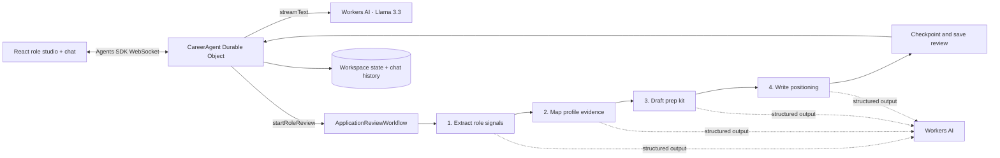

# 🧭 RoleSignal

### Make your next career move with evidence.

RoleSignal is an AI-powered career-preparation workspace built on Cloudflare. Give it a job description and a profile of skills and outcomes you can stand behind. It maps role requirements to that evidence, makes gaps visible, and drafts a practical preparation kit. A persistent chat agent helps you rehearse and refine your story.

> **Demo data:** The included candidate, achievements, metrics, employer, and role are fictional examples. Replace them with your own verified information before using the app for a real application. Do not use sensitive personal data in this demo.

<p align="center">
  <b>🧠 Workers AI</b> &nbsp;·&nbsp; <b>🔁 Workflows</b> &nbsp;·&nbsp; <b>💬 Agents SDK</b> &nbsp;·&nbsp; <b>🗃️ Durable Objects</b>
</p>

## ✨ What it does

- **Compare a role with real evidence.** Paste a job description and RoleSignal extracts the important requirements. It links each requirement to a skill or proof point in the candidate profile and keeps unsupported areas visible.
- **Explain the match.** The score comes from a published, deterministic rubric. It is a role-to-profile match signal, not a prediction of an interview or hiring outcome.
- **Prepare for the next step.** Receive targeted next actions, interview questions with practice angles, and a first-pass cover letter. Review and edit every claim before using it.
- **Continue in chat.** Ask a persistent career coach to explain a gap, choose a proof point, or help structure an interview answer. It is prompted to ask for missing details instead of inventing candidate facts.
- **Keep control of the decision.** RoleSignal does not apply for jobs, send messages, or contact employers.

## 🧩 How the assignment requirements are met

| Assignment component        | RoleSignal implementation                                                                                                 |
| --------------------------- | ------------------------------------------------------------------------------------------------------------------------- |
| **LLM**                     | Meta Llama 3.3 70B FP8 Fast on Cloudflare Workers AI for role analysis and streamed chat.                                 |
| **Workflow / coordination** | Cloudflare Workflows checkpoints the multi-step analysis and reports progress to the workspace.                           |
| **User input**              | React role form and chat served as Worker assets; the Agents SDK connects chat over WebSockets.                           |
| **Memory / state**          | A named Durable Object stores candidate profile, role reviews, and progress. The Agents SDK persists the chat transcript. |

## 🏗️ Architecture



### Request lifecycle

1. **Create or reconnect to a workspace.** The browser stores a random workspace name in `localStorage` and connects to `CareerAgent`. The Agent SDK syncs the current state over the WebSocket.
2. **Save candidate evidence.** The profile editor accepts a headline, skills, and editable proof points. Server-side Zod schemas validate those fields before the Durable Object saves them.
3. **Start a durable review.** The role form validates the company, title, and job description, creates a queued review record, and starts the `APPLICATION_REVIEW` Workflow.
4. **Analyze in checkpointed steps.** Each model call runs inside a Workflow `step.do` stage. The app receives progress updates while the Workflow extracts requirements, maps evidence, drafts preparation material, and writes the positioning summary.
5. **Resolve evidence and calculate the score.** The app looks up returned proof-point IDs in the submitted profile; an ID that does not exist cannot become a linked proof point in the result. The score and recommendation thresholds are calculated in application code.
6. **Persist the result.** The completed analysis is saved to the Agent's state. The browser can reconnect to the same role history and saved chat later using its workspace name.
7. **Chat with context.** The chat request includes the candidate profile and the selected role's summary/evidence context. The model streams a response through the Workers AI binding; chat history is persisted by the Agents chat runtime.

### The fit rubric

The model identifies role requirements and proposes evidence matches. RoleSignal uses these fixed weights to calculate the score:

| Requirement importance | Weight |
| ---------------------- | -----: |
| Must-have              |      3 |
| Important              |      2 |
| Nice-to-have           |      1 |

| Match strength                                        | Value |
| ----------------------------------------------------- | ----: |
| Strong, with a linked proof point                     |   1.0 |
| Partial, including a skill without an outcome example |   0.5 |
| Gap or no profile support                             |     0 |

**Formula:** `round(100 × sum(requirement weight × match value) / sum(requirement weights))`.

The recommendation labels are `strong fit` at 72 or above, `bridge gaps` from 45 through 71, and `stretch` below 45. Those cutoffs are product heuristics, not externally validated hiring criteria. A skill without a matching proof point is never promoted to the strongest evidence label by the mapping code. A person still needs to check that the model's semantic match and rationale are fair.

### Why these Cloudflare components

- **Agents SDK + Durable Objects:** the interaction is a continuing workspace, not a stateless form. A named Agent can keep structured state and chat history close to the conversation and reconnect over a WebSocket.
- **Workflows:** role review spans multiple model calls. Checkpointed stages make the progress visible and let the runtime resume durable work without treating the whole analysis as one long request.
- **Workers AI:** both the streamed chat and structured review use the same Cloudflare account binding and selected Llama model.
- **Worker-hosted assets:** one Worker project serves the React client and Agent routes, keeping the demo setup in one deployment.

## 📂 Project map

| File                     | What it contains                                                                                     |
| ------------------------ | ---------------------------------------------------------------------------------------------------- |
| `src/app.tsx`            | Role form, editable candidate profile, evidence map, score, prep kit, and chat UI.                   |
| `src/server.ts`          | `CareerAgent`, callable profile/review methods, Workers AI chat stream, and Workflow callbacks.      |
| `src/workflow.ts`        | Role extraction, evidence mapping, application-kit generation, positioning, score, and durable save. |
| `src/contracts.ts`       | Shared Zod schemas plus clearly fictional demo profile and job description.                          |
| `src/styles.css`         | Responsive visual design for the studio, evidence review, and chat panel.                            |
| `wrangler.jsonc`         | Workers AI, Durable Object, Workflow, SPA assets, migration, and observability configuration.        |
| `env.d.ts`               | Wrangler-generated Cloudflare binding/runtime types. Regenerate after changing bindings.             |
| `PROMPT_HISTORY.md`      | Assignment prompt and a transparent record of the implementation brief.                              |
| `PROJECT_WALKTHROUGH.md` | Short pitch, architecture explanation, demo path, and interview discussion points.                   |

## 🚀 Run locally

### Requirements

- Node.js **22.12 or newer** (or a Vite-supported Node version).
- A Cloudflare account with Workers AI access for the configured model.
- Network access for the `remote: true` Workers AI binding.

### Start the app

```bash
npm install
npx wrangler login
npm run dev
```

Open the local URL printed by Vite. The workspace starts with fictional sample data. Load the sample role or paste in a job description, then click **Map my fit**. The first review makes several model calls; follow the progress panel as the Workflow advances.

The `AI` binding in `wrangler.jsonc` is remote. Wrangler login and a working remote binding are required for model calls, role analysis, and chat.

### Generate binding types

After changing bindings, Workflow classes, or Durable Object configuration in `wrangler.jsonc`, regenerate the types:

```bash
npm run types
```

The generated types describe the `AI`, `CareerAgent`, and `APPLICATION_REVIEW` bindings used in TypeScript.

### Deploy to Cloudflare

```bash
npx wrangler login
npm run types
npm run deploy
```

`npm run deploy` builds the Vite app and asks Wrangler to deploy the Worker and declared resources to the account selected by `wrangler login`. This repository has not been deployed. Check model availability, account limits, and the resulting Worker configuration in your Cloudflare account before sharing a live URL.

## 🧪 Demo walkthrough

1. Show the profile and explain that every sample achievement and metric is fictional.
2. Edit a skill or proof point and save the profile.
3. Load the Northstar Labs sample role, then start a review.
4. As it runs, describe the Workflow stages and how its progress is written back to workspace state.
5. In the results, compare a proof-backed match, a skill-only partial match, and an explicit gap.
6. Explain that the score is a fixed weighted rubric, not a hiring prediction.
7. Ask the chat to help structure an interview answer from one proof point. Highlight that missing facts should be confirmed by the candidate.

See [`PROJECT_WALKTHROUGH.md`](./PROJECT_WALKTHROUGH.md) for a ready-to-use explanation and interview talk track.

## 🔐 Data handling, safety, and current limits

- **No authentication is configured.** The random browser workspace name is a routing identifier, not an identity or authorization check. Do not put real resumes, contact details, confidential job content, or sensitive employment history into a public deployment.
- **Use fictional or non-sensitive data for this demo.** Profile and role-review state are stored in the workspace Durable Object. The job description and profile are sent to Workers AI for role analysis; chat calls send the profile and selected role context to Workers AI.
- **The model can still be wrong.** Zod checks structure, profile IDs are resolved against submitted proof points, and the score is computed in code. These safeguards do not prove that a model's interpretation or rationale is semantically correct. Verify every result yourself.
- **No external actions.** The app has no tool for submitting applications, sending email, or contacting employers.
- **Workspace retention is basic.** The browser stores the workspace identifier in `localStorage`; clearing site data loses the identifier. The Agent retains up to 100 chat messages and the state keeps up to 12 role reviews.
- **Before using real candidate data, add:** authentication, per-user workspace authorization, deletion/export controls, explicit retention settings, and abuse/rate controls. Review model and observability settings for the intended privacy requirements.
- **Observability is enabled.** Application workflow failure logs include the review ID but omit the raw error and profile content.

## 🧭 Troubleshooting

| Symptom                                          | Check                                                                                                                                  |
| ------------------------------------------------ | -------------------------------------------------------------------------------------------------------------------------------------- |
| Role review or chat cannot call the model        | Run `npx wrangler login`; confirm the Cloudflare account and Workers AI model access; check the remote `AI` binding.                   |
| Binding or Workflow TypeScript names are missing | Run `npm run types` after updating `wrangler.jsonc`.                                                                                   |
| A review appears to start but does not finish    | Check the local Worker/Workflow logs and model response errors. Each structured model result must match the schema.                    |
| A previous workspace seems to be gone            | Check this browser's site storage. Its random workspace name is kept in `localStorage`; clearing it points the app at a new workspace. |

## 📝 AI-assisted coding prompt history

The assignment asks candidates to submit prompt history. The repository includes [`PROMPT_HISTORY.md`](./PROMPT_HISTORY.md), which preserves the assignment and the project direction, and labels the implementation prompt distilled from them. [`PROJECT_WALKTHROUGH.md`](./PROJECT_WALKTHROUGH.md) describes the architecture and demo presentation.

## 📚 References

- [Cloudflare Agents SDK](https://developers.cloudflare.com/agents/)
- [Chat agents](https://developers.cloudflare.com/agents/communication-channels/chat/chat-agents/)
- [Agents and Workflows](https://developers.cloudflare.com/agents/runtime/execution/run-workflows/)
- [Llama 3.3 70B FP8 Fast on Workers AI](https://developers.cloudflare.com/workers-ai/models/llama-3.3-70b-instruct-fp8-fast/)
- [Official Cloudflare Agents starter](https://github.com/cloudflare/agents-starter)
